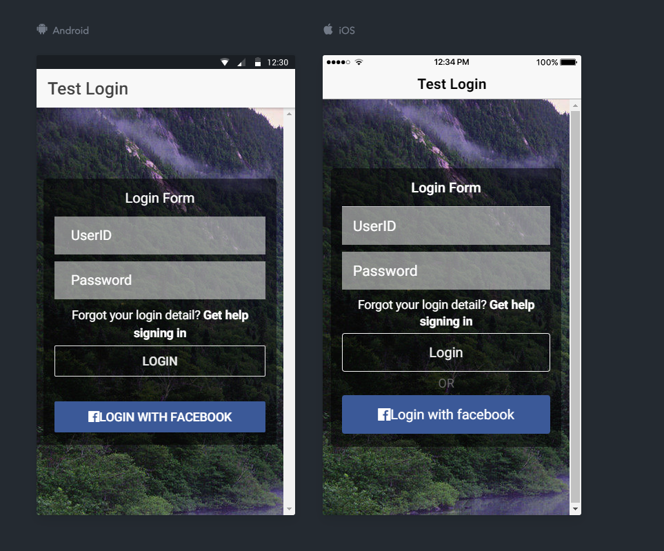

```bash
$ sudo npm install -g ionic cordova
$ ionic start myBlank blank
```

Then, to run it, cd into `myBlank` and run:

```bash
$ ionic cordova platform add ios
$ ionic cordova run ios
```

畫面 Picture



